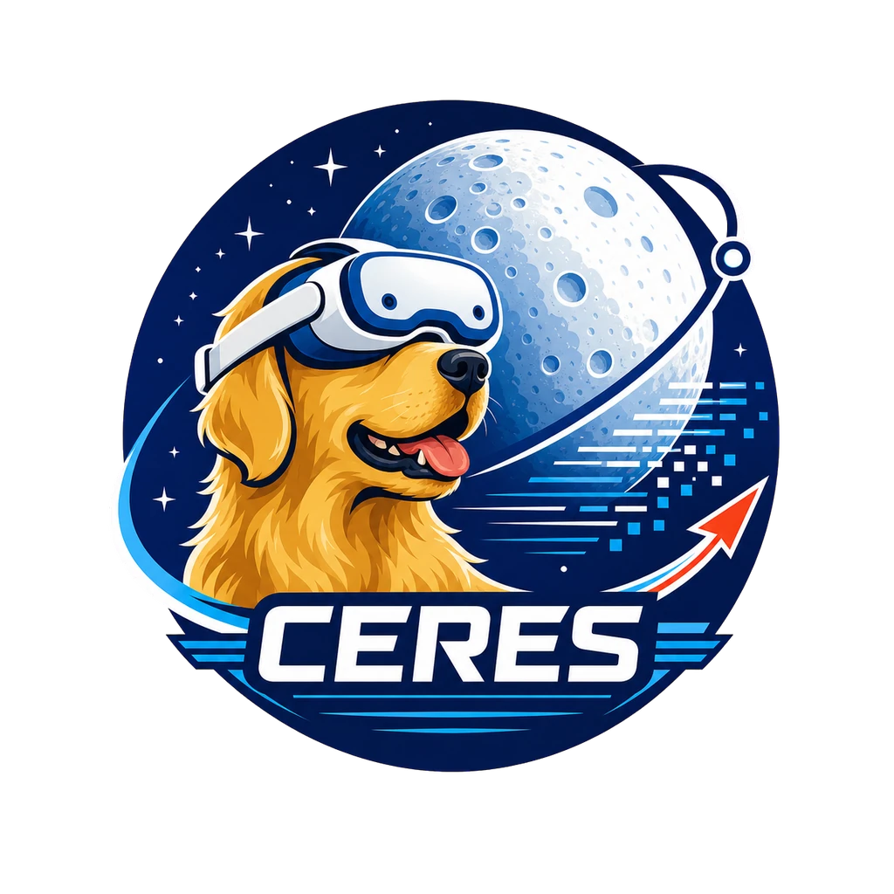

  

<h1 align="center">
  CERES 
  <a href="https://nerc2026.github.io/">[NERC'26]</a>
</h1>

  <strong>Egocentric capture for robotics and embodied AI.</strong>

  
  
  
  

  <a href="https://ceres.cam/"><strong>Open CERES</strong></a>
  &nbsp;&middot;&nbsp;
  <a href="https://ceres.cam/documentation/">User guide</a>
  &nbsp;&middot;&nbsp;
  <a href="https://ceres.cam/documentation/getting-started/">Quickstart</a>
  &nbsp;&middot;&nbsp;
  <a href="https://huggingface.co/spaces/chrisvoncsefalvay/ceres-dataset-viewer">Dataset viewer</a>

---

CERES turns Meta Quest into an egocentric research capture system. Record outward video, optional audio, head pose and both hands alongside a repeatable task protocol, then review and export your episodes as LeRobot v3 datasets. Work independently in **Solo**, direct a demonstrator in **Duet** or send live observations to an application in **Bridge**.

## Three modes, one system

| Mode | How you work | Get started |
| --- | --- | --- |
| **Solo** | One person configures, records, reviews and exports a run entirely on the headset. | [Launch Solo](https://ceres.cam/launch/capture/?mode=solo) |
| **Duet** | A capture director prepares the tasks and supervises a demonstrator from another browser. | [Open the capture director](https://ceres.cam/monitor/) |
| **Bridge** | Stream the live camera view, head pose and both hands to a Linux application. | [Launch Bridge](https://ceres.cam/bridge/) |

## From demonstration to dataset

Solo and Duet share the same task model and recorder. Build a sequence of tasks, set timings and repetitions, review takes and export the accepted episodes.

| Capture | Keep the context |
| --- | --- |
| **Video and optional audio** | Record the demonstrator's outward camera view and microphone. |
| **Head and hand tracking** | Preserve head pose, both 25-joint hands and tracking state. |
| **Structured tasks** | Keep task identity, repetitions, takes, outcomes and segment boundaries with the observations. |
| **Aligned recordings** | Retain source timestamps and explicit gaps when observations are missing. |
| **LeRobot v3 export** | Turn accepted episodes into datasets for review, sharing and training. |

## Start a capture

1. **Choose Solo or Duet.** Open [CERES](https://ceres.cam/) in Quest Browser for Solo, or open the [capture director](https://ceres.cam/monitor/) on a computer and pair the demonstrator's headset for Duet.
2. **Prepare and record the run.** Configure the task sequence, timings and repetitions, then follow the cues in the headset. In Duet, the capture director watches the live view and recording health.
3. **Review and export.** Review the takes, keep the accepted episodes and export the dataset. Open it in the [dataset viewer](https://huggingface.co/spaces/chrisvoncsefalvay/ceres-dataset-viewer) to inspect video, trajectories and task segments.

Read the [quickstart](https://ceres.cam/documentation/getting-started/) for the complete workflow.

## Connect a live application

Bridge sends live observations to a Linux receiver for applications that need the camera and tracking data as they arrive. [Install the receiver](receiver/README.md) on Ubuntu 24.04, run `ceres-bridge listen` and pair it with [Bridge on your Quest](https://ceres.cam/bridge/).

| Integration | Use the stream |
| --- | --- |
| **Python** | [Read frames, poses and tracking state](receiver/docs/python-api.md) from your own application. |
| **ROS 2 Jazzy** | [Publish images and typed poses](receiver/docs/ros2.md) to your robotics stack. |
| **Foxglove** | [View live video, head/hand geometry and tracking state](receiver/docs/foxglove.md) with the supplied layouts. |

## Documentation

| Guide | What it covers |
| --- | --- |
| [Setup and system requirements](https://ceres.cam/documentation/setup-and-system-requirements/) | Prepare your headset and choose hosted or self-hosted capture. |
| [Solo](https://ceres.cam/documentation/solo/) | Configure and complete a run on your own. |
| [Capture director](https://ceres.cam/documentation/capture-director/) | Prepare, supervise and review a Duet run. |
| [Headset HUD](https://ceres.cam/documentation/headset-hud/) | Read task cues, recording state and tracking indicators. |
| [Review and export](https://ceres.cam/documentation/review-and-export/) | Review completed runs and work with exported datasets. |
| [Data format](https://ceres.cam/documentation/data-description-and-output-format/) | Understand LeRobot v3 files, telemetry and CERES metadata. |
| [Bridge protocol](protocol/bridge/specification.md) | Pairing, transport and live stream behaviour. |

For Bridge integrations, see the [wire protocol and fixtures](protocol/bridge/README.md), [Foxglove specification](protocol/bridge/foxglove.md) and [stream measurements](receiver/docs/acceptance.md).

---

Copyright 2026 **HCLTech Robotics**. Distributed under [CC BY-NC 4.0](LICENCE.md).
